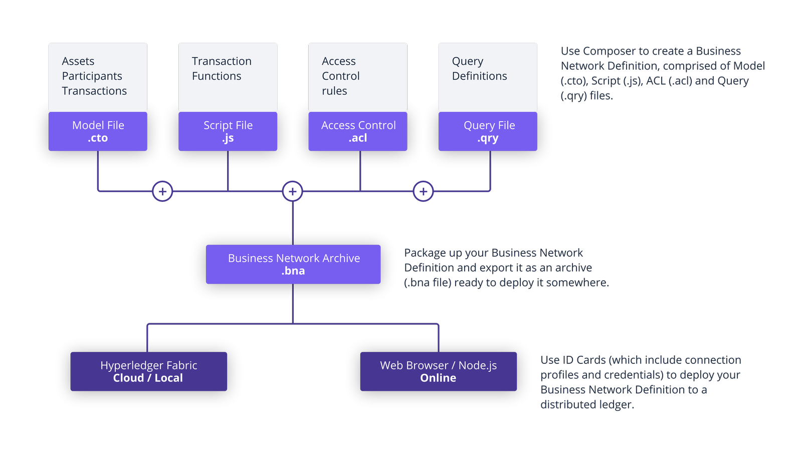

# Meetup

## Hyperleger Composer

Hyperledger Composer makes developing blockchain applications easier. Composer uses simple modeling language to model the business network and integrate with existing systems. 

Hyperledger Composer has the following components. 

## Model File .cto

[Read More Here](https://hyperledger.github.io/composer/latest/reference/cto_language.html)
Composer includes an object oriented modeling language and is used to define business network definition.
The CTO file has the following components.

  - A single namespace. All other component in the file are part of this namespace.
  - Set of resource definitions such as Assets, Transactions, Participants and Events.
  - Optional import declarations to access resource from other namespaces.

**Declarations of resources**
Resources in Hyperledger Composer include:

  - Assets, Participants, Transactions, and Events.
  - Enumerated Types.
  - Concepts.

**Assets, Participants, Transactions, and Events.**
A Resources has to have the following properties.

  - Be part of a namespace
  - Have a name
  - Have a identifying property
    /**
     * A vehicle asset.
     */
    asset Vehicle identified by vin {
      o String vin
    }
  - Optional super-type
    /**
     * A car asset. A car is related to a list of parts
     */
    asset Car extends Vehicle {
      o String model
      --> Part[] Parts
    }
  - Optional abstract declaration
    /**
     * An abstract Vehicle asset.
     */
    abstract asset Vehicle identified by vin {
      o String vin
    }
  - Set of named properties
  - Optional set of relationships to other Composer types
    /**
     * A Field asset. A Field is related to a list of animals
     */
    asset Field identified by fieldId {
      o String fieldId
      o String name
      --> Animal[] animals
    }

******Enumerated Types**
Just like enum is c++ or java, this is used to specify a type with 1 to N possible values. 

    /**
     * An enumerated type
     */
    enum ProductType {
      o DAIRY
      o BEEF
      o VEGETABLES
    }

Enumerated types can be used as properties of a Resource.

**Concepts**
Concepts are abstract classes that are not assets, participants or transactions. They are typically contained by an asset, participant or transaction.
Concepts can be abstract. But they do not need a identified by field since they can not be directly stored in the registry.

    abstract concept Address {
      o String street
      o String city default ="Winchester"
      o String country default = "UK"
      o Integer[] counts optional
    }
    
    concept UnitedStatesAddress extends Address {
      o String zipcode
    }

The concept like enum types can be used as a property of a Resource.

**Primitive types**
Composer resources are defined in terms of the following primitive types:

  - String: a UTF8 encoded String.
  - Double: a double precision 64 bit numeric value.
  - Integer: a 32 bit signed whole number.
  - Long: a 64 bit signed whole number.
  - DateTime: an ISO-8601 compatible time instance, with optional time zone and UTZ offset.
  - Boolean: a Boolean value, either true or false.

**Arrays**
All types in Composer may be declared as arrays using the [] notation.

    Integer[] integerArray

Is an array of Integers stored in a field called 'integerArray'. While

    --> Animal[] incoming

Is an array of relationships to the Animal type, stored in a field called 'incoming'.

## Script File .js

[Read More Here](https://hyperledger.github.io/composer/latest/reference/js_scripts.html)
Script file is the logic of composer model. 

    /**
    * A transaction processor function description
    * @param {org.example.basic.SampleTransaction} parameter-name A human description of the parameter
    * @transaction
    */

Every transaction or event needs a separate function. Each function needs `@param` tag connecting to the actual resource. And `@transaction` tag denoting the function as a transaction. 

## Access Control .acl

[Read More Here](https://hyperledger.github.io/composer/latest/reference/acl_language.html)
****
## Query File .qry (optional)

[Read More Here](https://hyperledger.github.io/composer/latest/reference/query-language.html)

[Go To Lab](./Lab.md)